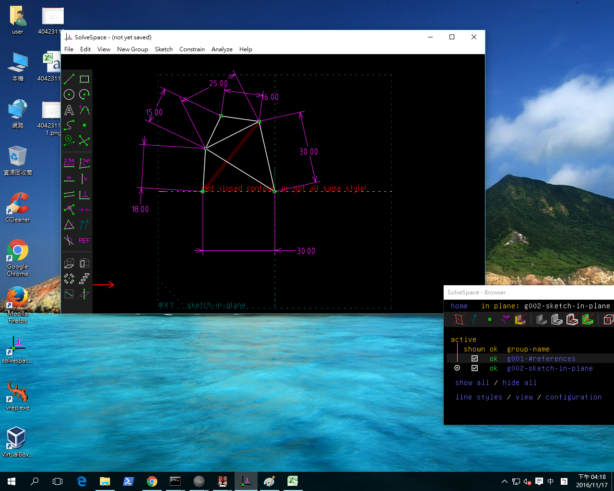

Title: 40423115 11/17 fourbar
Date: 2016-11-17 10:46
Category: HomeWork
Tags: 作業
Author: 40423115

<!-- PELICAN_END_SUMMARY -->

直接利用 Solvespace Analyze-Trace Point-Stop Trace 得到下列繞行路徑:

將所得到的點座標 .csv 以 Excel 畫圖, 得到:

